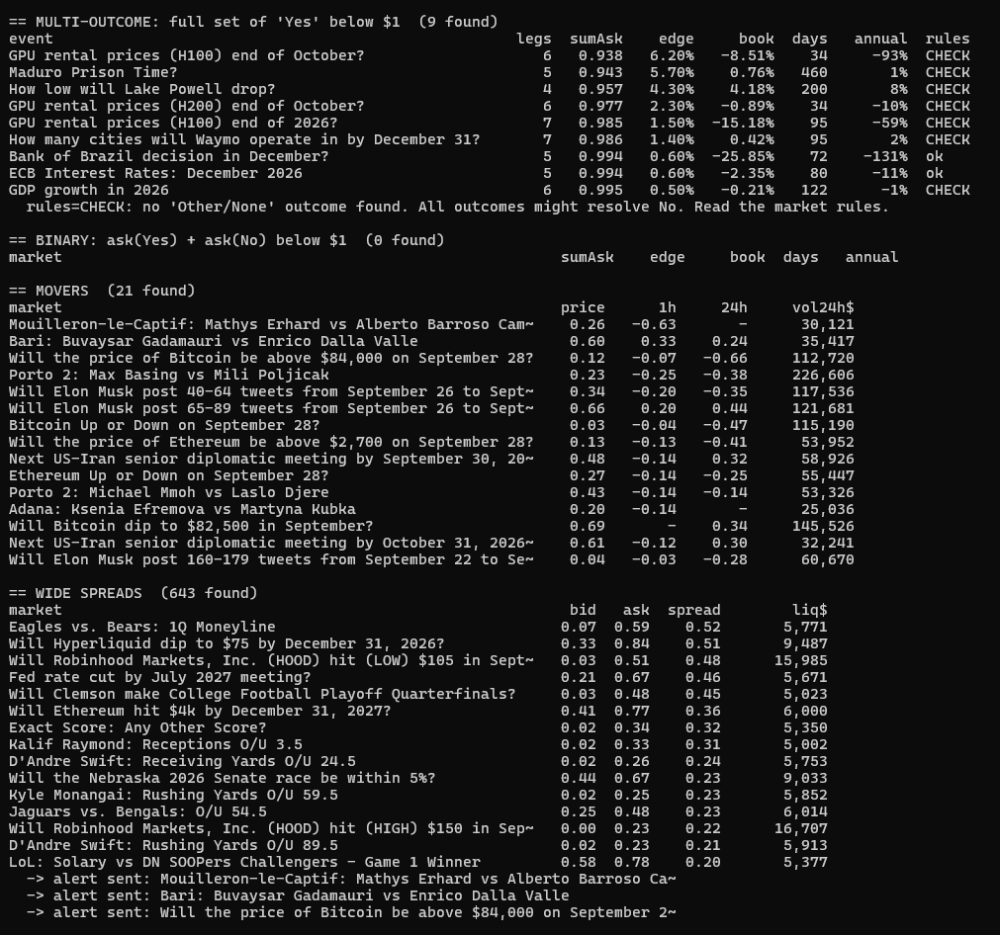
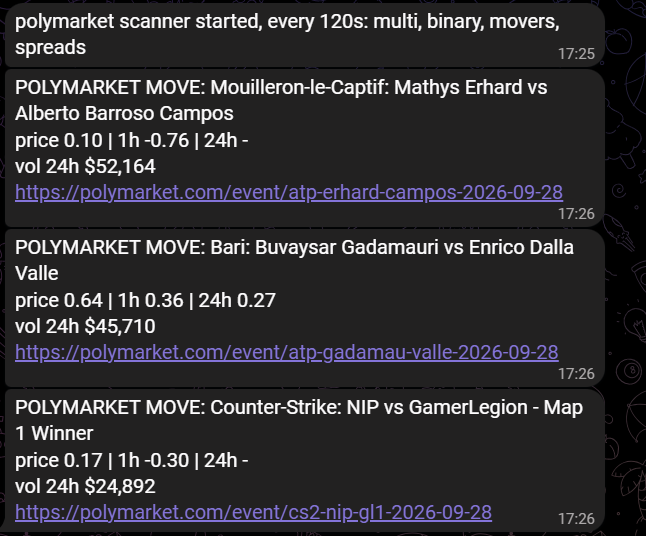

# Polymarket Scanner

A read-only scanner for [Polymarket](https://polymarket.com) prediction markets. It watches every active event, finds pricing inefficiencies, verifies them on the live order book, and sends alerts to **Telegram**.

No wallet, no API key, no trading. It only reads public market data.

 

---

## What it detects

| Detector | What it looks for | Why it matters |
|---|---|---|
| `multi` | Multi-outcome events (e.g. "Who will win?") where buying one **Yes** of every outcome costs **less than $1** | Exactly one outcome pays $1, so a full set bought below $1 locks in the difference at resolution |
| `binary` | Yes/No markets where **ask(Yes) + ask(No) < $1** | Same idea on a single market |
| `movers` | Sharp **1-hour / 24-hour** price moves on liquid markets | News is hitting the market; early warning for traders |
| `spreads` | Liquid markets with a **wide bid/ask spread** | Candidates for market making |

Arbitrage candidates are re-checked by **walking the real order book** for a chosen size (default 100 sets), so a thin best price does not count as an opportunity. Incomplete outcome sets are skipped, because buying only some outcomes is not an arbitrage.

For multi-outcome sets the scanner also shows **days to resolution** and an **annualised** return, since the capital is locked until the event resolves. Alerts are only sent above a minimum annualised return.

A discount on a full set is not always free money: if the listed outcomes do not cover every possibility, all of them can resolve **No**. The scanner marks sets without a catch-all outcome ("Other", "None", ...) as `CHECK` so you read the resolution rules first.

## Screenshots

| Scanner output | Telegram alert |
|---|---|
|  |  |

## Quick start

```bash
pip install -r requirements.txt

python polymarket_scanner.py                      # one scan, all detectors
python polymarket_scanner.py --loop 120           # every 2 minutes + Telegram alerts
python polymarket_scanner.py --only multi movers  # selected detectors only
```

On Windows, double-click `start_polymarket_scanner.bat`.

Telegram alerts: set `TELEGRAM_TOKEN` and `TELEGRAM_CHAT_ID` as environment variables.

## Main options

| Option | Default | Meaning |
|---|---|---|
| `--shares` | 100 | set size used for order book verification |
| `--min-edge` | 0.5 | minimum edge (%) to list an arbitrage |
| `--alert-edge` | 1.0 | minimum verified edge (%) for a Telegram alert |
| `--min-annual` | 15 | minimum annualised edge (%) for a Telegram alert |
| `--max-days` | 0 | ignore arbitrages resolving later than N days (0 = no limit) |
| `--min-volume` | 20,000 | minimum 24h volume (USD) for binary and mover checks |
| `--move-1h` / `--move-1d` | 0.08 / 0.20 | price move thresholds (in $, i.e. 8 and 20 cents) |
| `--fee` | 0 | taker fee fraction, for markets that charge one |
| `--loop` | 0 | rescan interval in seconds (0 = run once) |

## Data sources

- **Gamma API** (`gamma-api.polymarket.com`) for events, markets, prices and volume
- **CLOB API** (`clob.polymarket.com`) for order books

Both are public read endpoints.

## Notes and limits

- Edges shown are before gas and any market-specific fees. Check each market's rules before acting.
- Capital in a set arbitrage is locked until resolution; a small edge over many months can be a poor annual return.
- Resolution rules matter. Read them for every market.
- **Legal:** trading on Polymarket is restricted or prohibited in a number of countries. This tool only reads public data. Anyone who trades is responsible for complying with the laws of their own jurisdiction and Polymarket's terms.

## Disclaimer

For research and education. Not financial advice.

## Custom work

I build custom trading and market-data tools: prediction-market scanners, crypto bots (exchange APIs, Telegram), and MetaTrader 5 Expert Advisors.

Contact: Available for custom work on Upwork and Freelancer.com.
